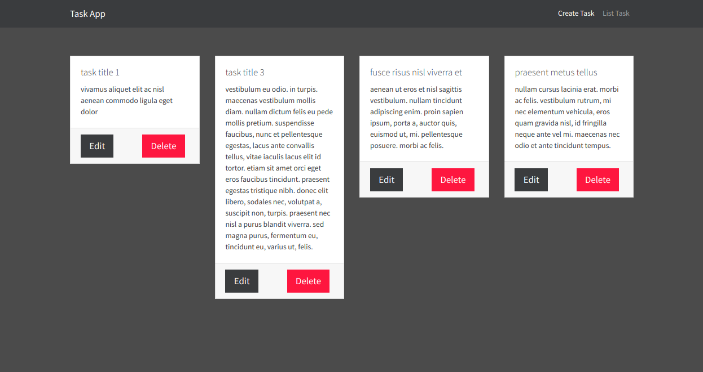
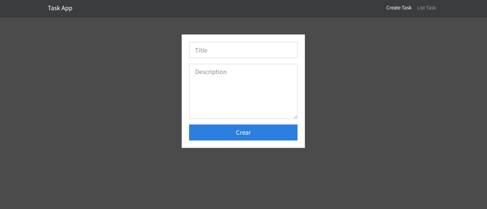

# Task Manager App with Typescript, NodeJs and MongoDB

This is an example where I implemented Typescript, NodeJS with Express and MongoDB. The app is a basic task manager.

### Task Listing Page

### Task Creation Page

